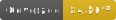

# Character Generator

Randomizes a character attribute list to be used for ideas in story or illustrations.

Site can be viewed here: https://chargen.netlify.com/




## Note
App will be setup to handle attribute configuration for random generation of any object of interest. Example: Auto-generate worlds, vehicles, stories. The first use case is for personal character ideation.

# Usage

```
yarn install
yarn start
```

1. Open webpage on localhost:3000
2. Click on "Generate Character" button to see output

# Tests

Uses [React Testing Library](https://testing-library.com/docs/react-testing-library/intro)

```
yarn test

// to run coverage locally
yarn test:coverage
```

# Roadmap

* Set up changelog and automatic versioning: https://github.com/semantic-release/semantic-release
* Convert to TypeScript
* After auto-generating a character, save to a persistent store at a unique URL. This can be shared or revisited
* Create login via email. Can see saved characters
* Create Folders to save different characters into

# Contribute

Join in with a Pull Request.

